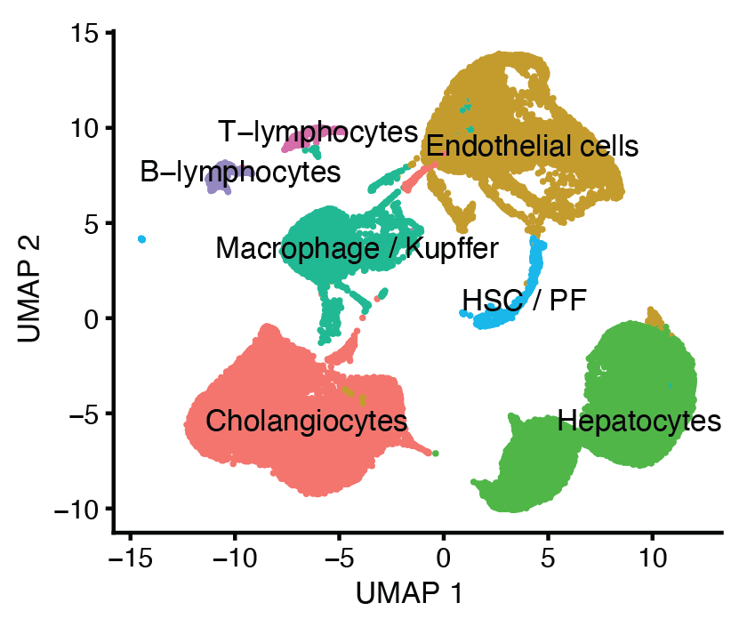
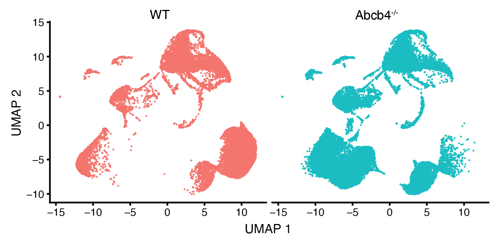
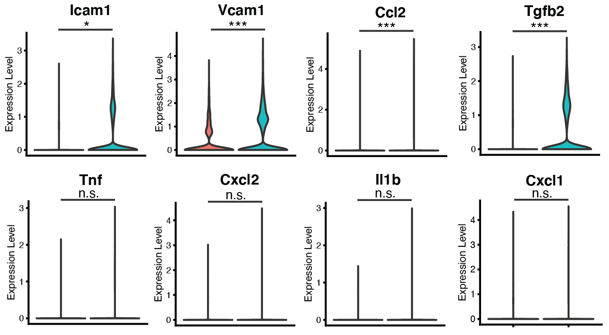
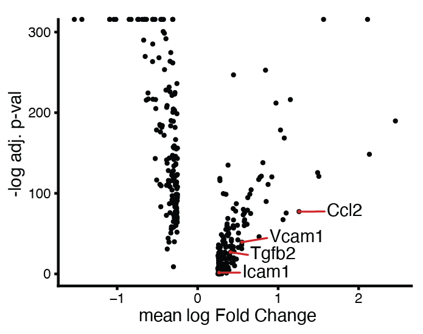
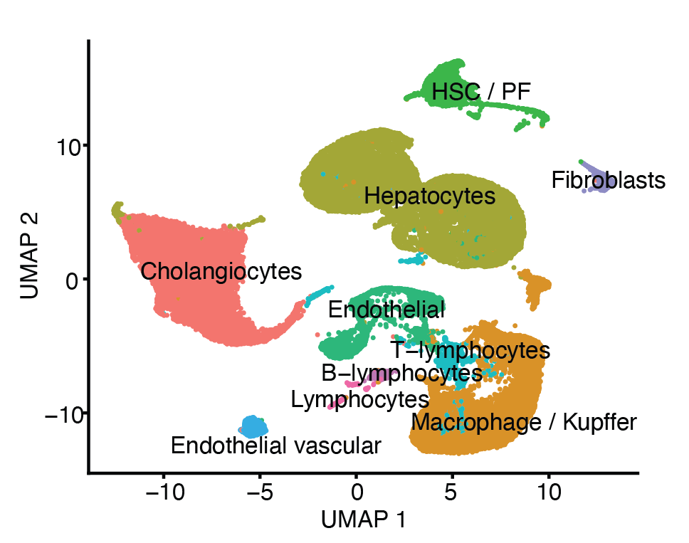
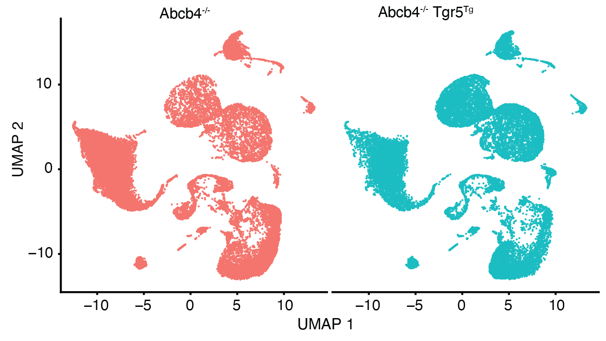
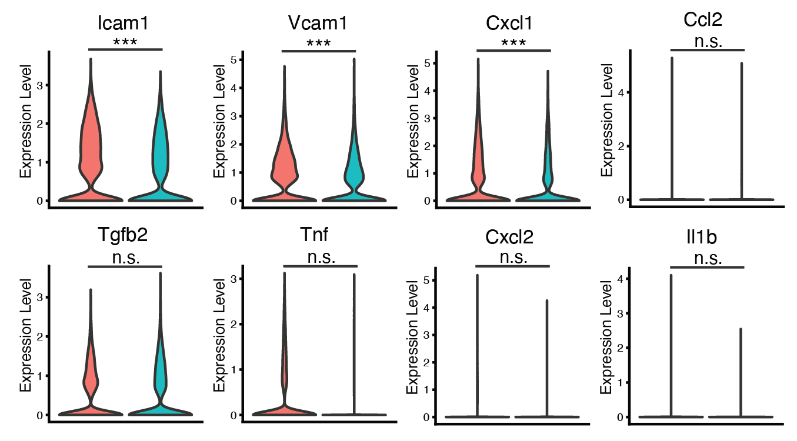
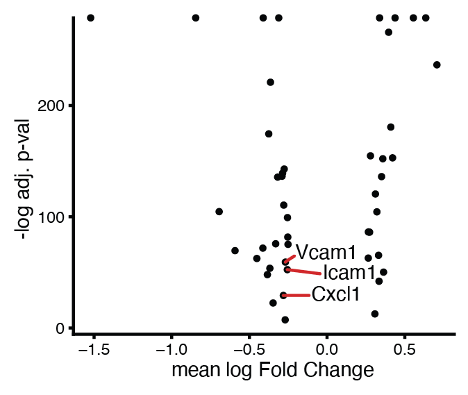

```{r setup, include=FALSE}
library(knitr)
knitr::opts_chunk$set(echo = FALSE)
```

Rmarkdown notebooks for single-cell data analysis of liver cells, to identify differentially expressed genes among cell populations.
The notebooks were run after processing the raw sequencing data with the cellranger pipeline.

These project results were published in the article:

***
**Downregulation of TGR5 (GPBAR1) in biliary epithelial cells contributes to the pathogenesis of sclerosing cholangitis.**

Reich M, Spomer L, Klindt C, Fuchs K, Stindt J, Deutschmann K, Höhne J, Liaskou E, Hov JR, Karlsen TH, Beuers U, Verheij J,
Ferreira-Gonzalez S, Hirschfield G, Forbes SJ, Schramm C, Esposito I, Nierhoff D, Fickert P, Fuchs CD, Trauner M, García-Beccaria M,
**Gabernet G**, Nahnsen S, Mallm JP, Vogel M, Schoonjans K, Lautwein T, Köhrer K, Häussinger D, Luedde T, Heikenwalder M, Keitel V.

_J Hepatol._ 2021 Apr 16:S0168-8278(21)00244-0.

DOI [10.1016/j.jhep.2021.03.029](https://doi.org/10.1016/j.jhep.2021.03.029). PMID: 33872692.

***

The original Rmarkdown notebooks can be found on [GitHub](https://github.com/ggabernet/scrnaseq-downstream).

### MDR2 KO vs WT experiment

Single-cell RNAseq data analysis of extracted liver cells from wild-type mice and mice with a MDR2 gene knock-out.

**A** Cholangiocytes (BECs) were enriched from whole liver lysates by FACS. UMAP visualization of 40.333 cells from wt and Abcb4-/- (MDR2 KO) mice (n=4 per genotype) showing cell clusters according to their gene expression.

```{r echo=FALSE}

```

**B** Clustering of the cell populations according to the genotype.
```{r echo=FALSE}

```

**C** Violin plots showing expression of selected genes in BECs from wt and Abcb4-/- mice
```{r echo=FALSE}

```

**D** Volcano plot of the differentially expressed genes in cholagiocytes (n=307) between wt and Abcb4-/- mice
```{r echo=FALSE}

```

### TGR5 TG vs MDR2 KO experiment

Single-cell RNAseq data analysis of extracted liver cells from mice with a MDR2 gene knock-out and mice additionally with a TGR5 transgene overexpression.

**A** Intrahepatic Cholangiocytes (BECs) were enriched by FACS prior to scRNA-seq. Clustering of 47.764 cells from Abcb4-/-Tgr5wt (MDR5 KO, denoted as Abcb4-/-) and Abcb4-/-Tgr5Tg mice (n=4 per genotype) using expression of marker gene signatures
```{r echo=FALSE}

```

**B** Clustering of cell populations according to the genotype.
```{r echo=FALSE}

```

**C** Violin plots showing gene expression in BECs from Abcb4 -/-Tgr5wt and Abcb4-/-Tgr5Tg (n=4 per genotype).
```{r echo=FALSE}

```

**D** Volcano plot of the differentially expressed genes in cholagiocytes (n=46) between Abcb4-/-Tgr5wt and Abcb4-/-Tgr5Tg.
```{r echo=FALSE}

```